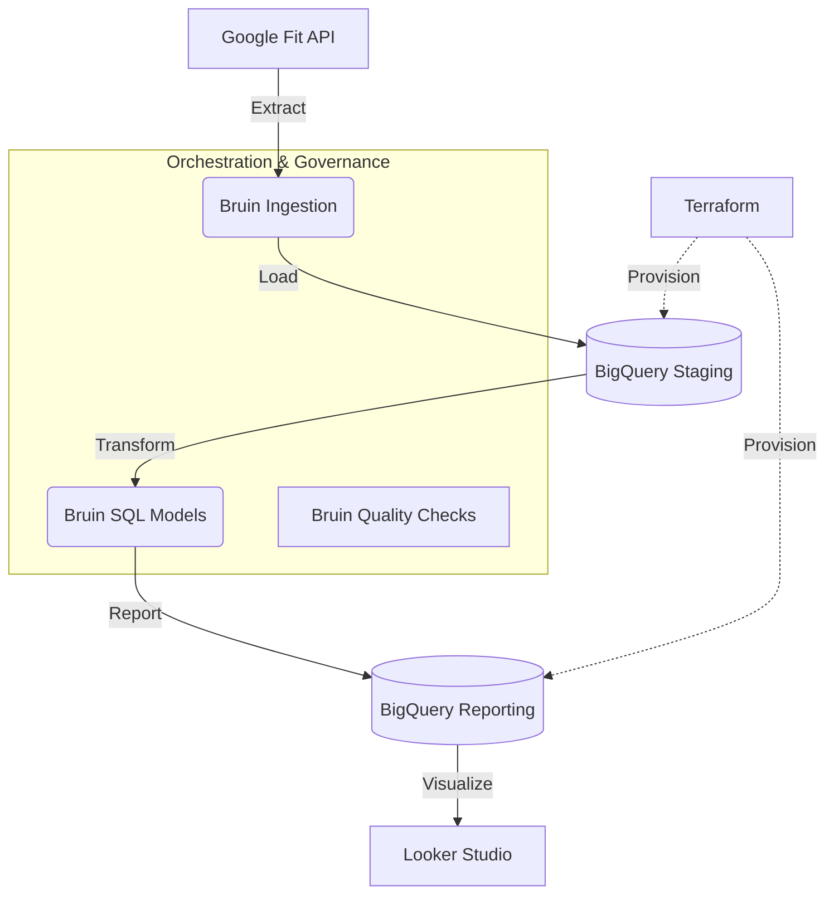
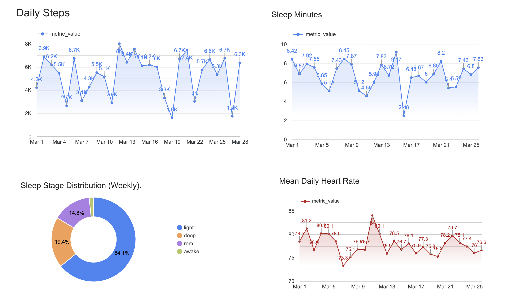
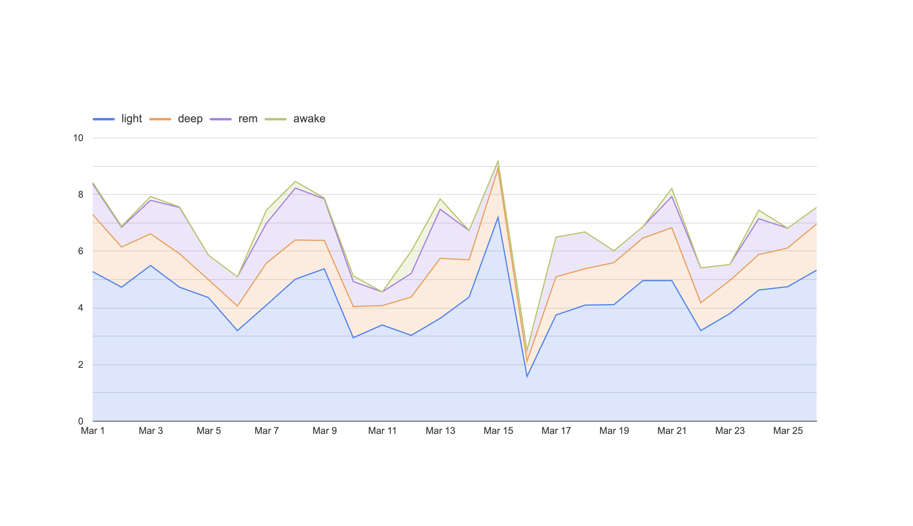

# Google Fit Bridge: End-to-End Health Data Platform

This project provides a professional data engineering solution to extract, warehouse, and analyze personal health metrics from the Google Fit API. It is designed to demonstrate modern best practices in Infrastructure as Code (IaC), automated orchestration, and data warehouse optimization.

---

## Architecture and Thought Process

The platform follows an **ELT (Extract, Load, Transform)** pattern, specifically designed to handle the asynchronous nature of wearable health devices.



### 1. The Problem (The "Why")
Personal health data from Google Fit is often isolated within mobile applications with limited analytical capabilities. Users cannot easily join their heart rate data with sleep stages or perform custom long-term health analytics. This project bridges that gap by moving the data into a high-performance analytics environment (BigQuery).

### 2. The Implementation (The "How")
*   **Ingestion**: A custom Python script handles the OAuth2 handshake and fetches raw metrics (steps, heart rate, sleep) from the Google Fit REST API.
*   **Deduplication**: Since raw health data can be overlapping, the staging layer uses `QUALIFY ROW_NUMBER()` logic to ensure only the most recent version of any record is stored.
*   **Optimization**: We implemented **Partitioning** and **Clustering** to ensure that queries (especially from Looker Studio) are cost-effective and sub-second.

---

## Replication and Setup Guide

### 1. Prerequisites
*   A **Google Cloud Project** with BigQuery enabled.
*   **Google Fit API Credentials**: You must place `credentials.json` and `token.json` (generated via `auth_fit.py`) in the root directory.
*   **Terraform CLI** installed.

### 2. Infrastructure Setup
First, provision the BigQuery datasets:
```bash
cd terraform
terraform init
terraform apply
```

### 3. Pipeline Configuration
Configure your `.bruin.yml` file with your `project_id`. Ensure your `service_account.json` is located in the root directory for authentication.

#### 4. Running the Pipeline
The pipeline is orchestrated by **Bruin**. It organizes tasks into a Directed Acyclic Graph (DAG).

```bash
# To run the entire pipeline:
bruin run ./google-fit-pipeline/pipeline/

# To perform a full month backfill (e.g., March 2026):
bruin run ./google-fit-pipeline/pipeline/ --full-refresh --start-date 2026-03-01 --end-date 2026-03-29
```

---

## Challenges and Solutions

### Challenge: Hardware Sync Latency
During development, we discovered that while "Steps" sync instantly, "Heart Rate" and "Sleep" data from wearable devices (like Xiaomi/Mi Band) often reach the Google Fit cloud with a 2-3 day delay.

**The Solution**: We implemented a **Sliding Window Backfill**. Instead of only querying today's data, the pipeline allows for a broad time-interval run (using `--start-date`) combined with a `time_interval` materialization strategy. This ensures that late-arriving data is "swept up" and correctly merged into the warehouse without creating duplicates.

---

## Data Model and Visuals

### Reporting Tables
*   **`reports.fitness_daily`**: Daily totals for steps and averages for heart rate.
*   **`reports.sleep_stages`**: Granular breakdown of sleep quality (Deep, Light, REM).

### Dashboard Requirements
The project includes a Looker Studio dashboard featuring:
1.  **Temporal Analysis**: A Stacked Area Chart showing the distribution of sleep stages over time.
2.  **Categorical Analysis**: A Donut Chart depicting the overall sleep quality ratio.
3.  **Goal Tracking**: A Daily Steps timeline with a 10,000-step reference goal.

---

### Live Dashboard
The final analytics can be accessed at the following Looker Studio link:
[Google Fit Bridge Reporting](https://lookerstudio.google.com/reporting/0103dc81-2b3b-4db5-9ac7-fdcff388b90a)

---

### Dashboard Visuals
Below are snapshots of the final health analytics platform implemented in Looker Studio.

#### 1. Main Performance Dashboard
Displays daily steps, sleep duration, and average heart rate trends over the last month.


#### 2. Sleep Quality Analysis
A granular look at sleep stage distributions (Deep, Light, REM) using a Stacked Area Chart.

